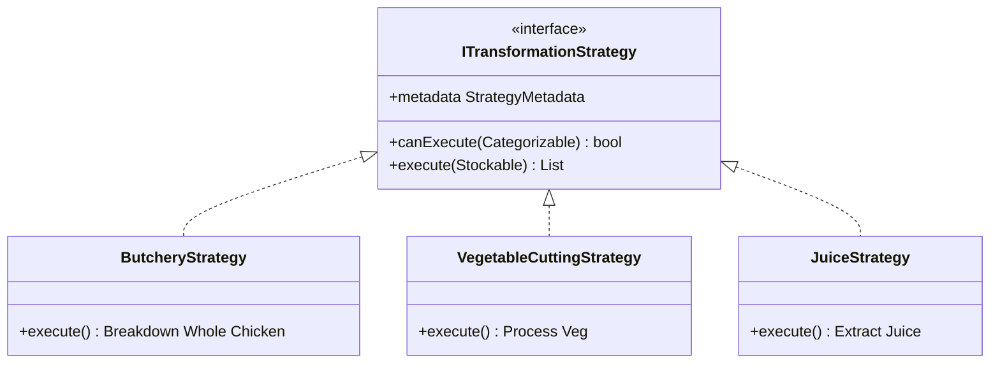

# Inventory Transformation Module

## Overview
The Inventory Transformation module enables the conversion of raw ingredients into processed items. It handles complex yield calculations, cost allocation across cuts, and waste tracking, ensuring accurate inventory levels and food cost analysis.

## Core Architecture

The module utilizes the **Strategy Pattern** to handle different types of processing logic (Butchery, Cutting, Juicing) in a decoupled and extensible manner.



## Transformation Process Flow

1.  **Item Discovery**: The `TransformationBloc` loads items from the `ITransformationRepository`.
2.  **Capability Filtering**: The `StrategyFilterService` identifies which strategies can be applied to each item based on its `category`.
3.  **Transformation Execution**: 
    - The user provides an input quantity.
    - The selected `ITransformationStrategy` executes, calculating:
        - **Main Outputs**: High-value processed items.
        - **By-products**: Secondary usable items (e.g., bones for stock).
        - **Waste**: Non-usable materials (skin, trim).
4.  **Result Review**: The `TransformationResultScreen` displays the calculated yields and costs.
5.  **Manual Adjustment**: Chefs can edit the final quantities of outputs to account for real-world variance.
6.  **Stock Synchronization**: The `UpdateStockEvent` persists the transformation by:
    - Adding new processed items to inventory.
    - Updating existing stock levels.
    - Marking the transformation record as complete.

## Key Strategies & Logic

### Butchery Strategy
- **Yield Logic**: Uses restaurant-standard percentage breakdowns (30% legs, 25% breast, etc.).
- **Cost Allocation**: Implements weighted cost allocation where premium cuts (breast) absorb more of the raw material cost than by-products (bones).

### Vegetable & Fruit Processing
- Handles simple processing like dicing or juicing.
- Flexible category matching (handles both `veg` and `vegetable`).

## Extensibility

### Adding New Strategies
The system supports a plugin architecture via `StrategyPluginRegistry`. New strategies can be added without modifying the core codebase by registering them with the factory.

```dart
// Example Registration
StrategyPluginRegistry.register(MyNewStrategy());
```

## Data Entities

- **InventoryItem**: Implementation of `Stockable` and `Categorizable`.
- **TransformationResult**: A container for the outcome of a process, including timestamp, yield statistics, and output lists.
