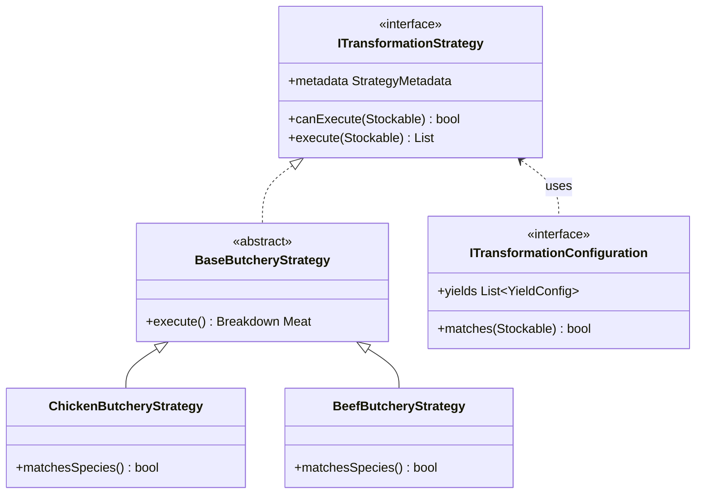

# Inventory Transformation Module

## Overview

The Inventory Transformation module enables the conversion of raw ingredients into processed items. It handles complex yield calculations, cost allocation across cuts, and waste tracking, ensuring accurate inventory levels and food cost analysis.

## Core Architecture

The module utilizes a **Configuration-Driven Strategy Pattern** to handle different types of processing logic in a decoupled and extensible manner.



## Transformation Process Flow

1.  **Item Discovery**: The `TransformationBloc` loads items from the `ITransformationRepository`.
2.  **Capability Filtering**: The `StrategyFilterService` identifies supported strategies. Each strategy delegates its applicability check to an `ITransformationConfiguration` via the `matches(Stockable)` method.
3.  **Transformation Execution**:
    - The user provides an input quantity.
    - The strategy calculates yields and costs based on the `YieldConfig` provided by its configuration.
    - **Polymorphic Costing**: Premium cuts absorb more cost based on their `costFactor`.
    - **Waste Identification**: Items marked `isWaste: true` have their costs zeroed out automatically.
4.  **Result Review**: The `TransformationResult` entity (Rich Domain Model) calculates yield statistics (yield %, waste %) automatically.
5.  **Stock Synchronization**: The processed items are saved back to the repository as new `Stockable` entries.

## Key Principles & Patterns

### 1. Configuration-Driven OCP

The system is **Open for Extension but Closed for Modification**. To add a new transformation (e.g., Fish Butchery), you simply create a new `ITransformationConfiguration`. No changes to the `ButcheryStrategy` logic are required.

### 2. Liskov Substitution (LSP)

All transformation logic operates on the `Stockable` and `Wasteable` abstractions. The system treats all items uniformly, whether they are raw ingredients, processed cuts, or waste products.

### 3. Dependency Inversion (DIP)

High-level modules (BLoC, UseCases) depend on interfaces (`ITransformationStrategy`, `ITransformationRepository`) rather than concrete implementations.

## Extensibility

### Adding New Strategies

The system uses **Dependency Injection (DI)** for automatic discovery. New strategies and configurations are registered automatically.

1.  **Create Configuration**: Implement `ITransformationConfiguration` with your yields and matching rules.
2.  **Create Strategy**: Implement `ITransformationStrategy` (or extend `BaseButcheryStrategy`).
3.  **Generate Code**: Update the DI container:
    ```bash
    flutter pub run build_runner build --delete-conflicting-outputs
    ```

## Data Entities

- **Stockable**: Base interface for all inventory items.
- **Wasteable**: Core interface for items that represent waste (defines `isWaste`).
- **InventoryItem**: Concrete implementation of `Stockable` and `Wasteable`.
- **TransformationResult**: Rich entity containing yields, costs, and summary statistics.
